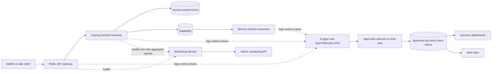

# Backend Observability Strategy

Status: Accepted for the POC
Owner: Platform and service owners
Related Jira: FIN-190

## Purpose

This document is the normative observability contract for every Financial
Assistant backend API, worker, gateway, and technical utility. It defines one
privacy-safe approach for logs, metrics, traces, health checks, dashboards, and
alerts without making telemetry a source of financial truth.

Observability answers technical questions about availability, latency,
dependency health, asynchronous lag, and controlled feature outcomes. It is not
an audit journal, analytics warehouse, financial ledger, receipt archive, or
LLM/OCR history.

The strategy extends the existing
[safe operational log policy](../engineering/safe-operational-log-policy.md),
[structured logging and correlation baseline](../engineering/structured-logging-and-correlation.md),
[gateway correlation contract](../engineering/gateway-correlation-tracing-and-logging.md),
[integration event envelope](../events/event-contract-versioning.md), and
[Monitoring Service](../../backend/services/monitoring/README.md). Service
documentation may add stricter rules but must not weaken this contract.

## Principles

### OBS-001: Signals are technical and minimized

Emit only the smallest stable technical fields needed to operate the system.
Never emit request or response bodies, arbitrary headers, query values,
domain payloads, or serialized objects.

### OBS-002: Correlation is not identity

`CorrelationId`, W3C `TraceId`, `SpanId`, and event `CausationId` join
technical work across boundaries. They must be validated, bounded, opaque, and
must never contain a user, account, session, transaction, receipt, merchant, or
provider identifier.

### OBS-003: Each service owns its signals

The service that owns an operation owns its event catalog, custom metrics,
spans, health checks, runbook, dashboard panels, and alert response. The
Monitoring Service aggregates privacy-safe operational state; it does not take
ownership of another service's behavior or financial data.

### OBS-004: Financial authority remains in deterministic services

Logs, traces, metrics, health responses, dashboards, and alerts are diagnostic
projections. They cannot create, repair, infer, or override a transaction,
balance, limit, report, score, recommendation, or confirmed financial entity.

### OBS-005: Export is an explicit release decision

Local JSON console logging and in-process instrumentation may run without an
external provider. Production collectors, exporters, retention, sampling, and
alert destinations require documented privacy, security, availability, and cost
approval. Missing optional exporters must not block a service's core behavior.

## Signal path



The collector and external signal stores are target deployment components.
They may be disabled in the local and controlled POC environments. The
Monitoring Service remains aggregate-only and never receives raw log messages,
trace payload attributes, request bodies, financial values, or user labels.

## Resource identity

Every signal source declares these bounded resource attributes:

| Attribute | Rule |
| --- | --- |
| `service.name` | Stable assembly or deployment name |
| `service.version` | Release version, never a branch or user-controlled value |
| `deployment.environment.name` | Controlled value such as `local`, `test`, or `poc` |
| `service.instance.id` | Ephemeral opaque instance value; not a host user name |

Environment, region, cluster, and instance values belong on the resource. They
must not be repeated as high-cardinality metric labels.

## Structured logs

All production operational events use JSON output and source-generated
`LoggerMessage` definitions with a stable numeric `EventId`, stable
PascalCase `EventName`, constant template, explicit level, and allowlisted
fields. Service event-ID ranges and event catalogs live with the owning service.
IDs and names are contracts used by dashboards and alerts and cannot be reused
for a different meaning.

Allowed common fields are:

```text
CorrelationId
TraceId
SpanId
CausationId
RequestMethod
RouteKey
Operation
Outcome
StatusCode
ElapsedMilliseconds
FailureType
AttemptCount
RetryDelaySeconds
QueueName
EventType
SchemaVersion
```

`Operation`, `Outcome`, `RouteKey`, `QueueName`, and `EventType` must
come from a bounded service-owned catalog. `FailureType` is the exception type
name only. Exception objects, exception messages, stack traces, provider
responses, and internal connection values are prohibited by default.

Use `Information` for completed lifecycle outcomes, `Warning` for expected
degradation or retry, and `Error` for an operation that cannot complete.
`Debug` may add bounded technical state in non-production environments but
does not relax the data policy.

## Correlation and distributed traces

HTTP uses W3C Trace Context. The Public API Gateway validates or creates the
opaque `CorrelationId`, continues `traceparent` and `tracestate`, and
forwards canonical correlation headers. Each API continues the current
`Activity`; outgoing HTTP clients create client spans.

RabbitMQ producers copy `CorrelationId`, `CausationId`, and trace context
through the versioned event envelope. Consumers create a new consumer span
linked to the producer context and preserve the envelope correlation values.
A retry keeps the same correlation and causation values but records the bounded
attempt number.

Required span kinds:

| Boundary | Span kind | Required safe attributes |
| --- | --- | --- |
| HTTP ingress | Server | route template or configured route key, method, status code |
| HTTP dependency | Client | configured dependency name, method, status code |
| RabbitMQ publish | Producer | configured exchange/routing key, event type, outcome |
| RabbitMQ consume | Consumer | configured queue, event type, outcome, attempt |
| Internal operation | Internal | bounded operation name and outcome |

Do not put raw URL paths, query strings, headers, baggage, message bodies,
financial values, provider model names tied to a user, or domain identifiers in
span names or attributes. Record failures with status and `FailureType`, not
exception messages. Sampling must retain errors and representative latency
while respecting the approved cost budget; no service may silently choose an
unbounded exporter or sampling policy.

## Metrics

Every request-serving service implements the RED baseline:

- request or operation rate;
- error count by bounded outcome/status class;
- duration histogram in milliseconds.

Every queue or worker implements:

- accepted, completed, retried, and failed counts;
- queue depth when available;
- oldest-message or processing lag in seconds;
- processing duration.

Every required dependency implements:

- call count and bounded outcome;
- duration;
- readiness state;
- circuit/retry state when present.

Custom names use `financial_assistant.<service>.<signal>` in lower-case
snake_case. Counters end in `_total`; durations use histogram unit
`milliseconds`; queue age uses `seconds`. Metric names and units are stable
contracts.

Allowed dimensions are bounded enums or configured catalog keys such as
`operation`, `outcome`, `status_class`, `dependency`, `queue`,
`event_type`, and `provider_kind`. The following are prohibited metric
labels: user/account/session/device IDs, correlation/trace IDs, transaction or
draft IDs, receipt/object keys, merchant/category/currency/amount, free text,
raw path, exception message, prompt/model response, email, or phone.

## Health checks

Each HTTP host exposes:

```text
GET /health/live
GET /health/ready
```

`/health/live` proves only that the process and request pipeline can run. It
must not call a database, broker, object store, provider, or another service.

`/health/ready` validates configuration and only the dependencies required to
serve the component's core responsibility. Optional OCR, LLM, recommendation,
notification, analytics, or exporter dependencies report degraded/not
configured through monitoring but do not fail readiness unless the service
cannot fulfill its core contract without them.

Healthy endpoints return HTTP 200; an unready endpoint returns HTTP 503.
Responses expose only component name, aggregate status, checked time, and
bounded dependency categories. They never expose connection strings, hosts,
credentials, exception text, documents, queue payloads, or financial state.
Checks use the `live` and `ready` tags. The compatibility `/health`
endpoint may remain, but deployment probes use the explicit endpoints.

## Service requirements

Every listed component implements the common HTTP/worker/dependency baseline
that applies to it and the following owned signals:

| Owner | Required service-specific signals |
| --- | --- |
| Public API Gateway | route-key request rate/errors/duration, authentication and rate-limit outcomes, downstream availability/timeout, live/ready |
| Identity | registration/login/session technical outcomes, authorization rejects, outbox count/oldest age/retries, live/ready |
| Profile and Category | request rate/errors/duration, update outcome, required-store readiness, published-event/outbox health |
| Transaction Intake | draft create/confirm/reject outcomes, parsing outcome class, processing duration, inbox/outbox lag, required dependency readiness |
| Income and Expense | command/query outcome, archive/restore outcome, inbox/outbox count/lag/retries, required-store readiness |
| Receipt Processing | job accepted/completed/review-required/failed, queue age, processing duration, bounded provider outcome, required-store/broker readiness |
| AI Orchestration | call outcome, latency, token counters and estimated cost micros as aggregates, budget/fallback outcome, provider-kind availability |
| Financial Summary and Analytics | projection lag, stale/rebuild outcome, consumed-event count/retries, query duration, required-store/broker readiness |
| Financial Score | calculation/query outcome, stale input category, duration, required-store readiness |
| Recommendations and Notifications | generation/preparation/delivery outcome, queue age/retries, channel-kind outcome, required-store/broker readiness |
| Monitoring | probe status/latency, signal acceptance/rejection, snapshot freshness, configured target coverage |
| Audit | append/query/export technical outcome, rejected event type, persistence readiness; never audit payload content in operational telemetry |
| MCP | tool-name catalog, authorization outcome, invocation duration/outcome; never tool arguments, results, prompts, or financial data |

This table defines the required categories, not permission to add labels. Each
service README maps them to its stable event IDs, metric names, spans, health
dependencies, dashboard panels, and runbook.

## Alert priorities

Alerts are symptom-based, deduplicated, and actionable. They include service,
environment, severity, started time, affected technical capability, dashboard
link, and runbook link. They never include log bodies or sensitive fields.

| Priority | Meaning | Default response |
| --- | --- | --- |
| P1 Critical | confirmed financial correctness risk, security boundary failure, data loss/corruption risk, or broad inability to use the core product | immediate page and release/deployment stop |
| P2 High | sustained critical-service unavailability, high error rate, blocked event processing, or exhausted provider/cost guardrail | page the on-call owner |
| P3 Medium | degraded dependency, growing lag, latency regression, partial optional feature loss, or missing monitoring coverage | operator notification and same-day triage |
| P4 Low | capacity trend, noisy retry, expiring operational task, or informational anomaly | backlog/runbook review |

Initial controlled-POC thresholds are conservative defaults:

- P1 on any detected financial correctness/security invariant breach or
  confirmed lost authoritative event;
- P2 when a critical service is unready for two consecutive probes, HTTP 5xx is
  at least 5% for 5 minutes with at least 20 requests, or required queue age
  exceeds 5 minutes;
- P3 when p95 latency exceeds the service objective for 15 minutes, optional
  dependency degradation lasts 15 minutes, or queue age shows sustained growth;
- P4 for capacity or retry trends without current user impact.

Service owners tune thresholds using synthetic load and controlled production
evidence. Threshold changes are reviewed configuration changes, not ad hoc
dashboard edits. Low traffic never divides by zero or pages on one synthetic
failure.

## Dashboard requirements

The platform overview provides:

1. release/environment identity and signal freshness;
2. gateway throughput, error rate, and p50/p95/p99 latency;
3. service live/ready state and required dependency status;
4. RabbitMQ depth, oldest age, consumer count, retry, and dead-letter trends;
5. Elasticsearch status and projection freshness;
6. AI/OCR aggregate request, success, fallback, token, and estimated-cost
   guardrails without content;
7. receipt, parsing, confirmation, summary, score, recommendation, notification,
   audit, and MCP technical outcome funnels;
8. active alerts grouped by owner and priority.

Every panel declares owner, signal name, unit, aggregation, time window,
freshness, expected range, and runbook. A dashboard must show no-data separately
from zero and unavailable separately from healthy. Drill-down follows
`CorrelationId` or `TraceId` only in access-controlled tools.

## Privacy, security, retention, and cost

Never emit credentials, personal identities, request/response bodies, financial
values, receipts, OCR text, prompts, completions, recommendations, embeddings,
provider payloads, audit content, or real test data into any signal.

Telemetry transport and storage use encryption, least-privilege access,
environment separation, shortest practical retention, and audited operator
access. Production telemetry is not copied into Jira, Confluence, chat, or test
fixtures without approved redaction.

Cardinality, retention, sampling, dashboard refresh, and alert evaluation have
explicit budgets. Paid exporters and notification destinations remain disabled
until the release owner approves their provider, privacy terms, credentials,
rate limits, and maximum spend. Cost-protection alerts use aggregate technical
counts only.

## Adoption and verification

A service is observability-compliant only when its README and tests identify:

- stable log event IDs/names and allowlisted fields;
- correlation and trace propagation at every owned boundary;
- RED/worker/dependency metric names, units, and bounded dimensions;
- `/health/live` and `/health/ready` dependency semantics;
- dashboard panels and a named owner;
- P1-P4 alert rules and runbook links;
- exporter/sampling/retention configuration and cost guardrails;
- tests proving sensitive values are absent.

New services begin from the service template. Existing services adopt the
contract incrementally through their owning P8 tickets. CI and review must reject
unbounded labels, direct free-form production logging, body/payload telemetry,
dependency-backed liveness, sensitive health output, or undocumented exporters.

Use synthetic identifiers and values for all verification.
